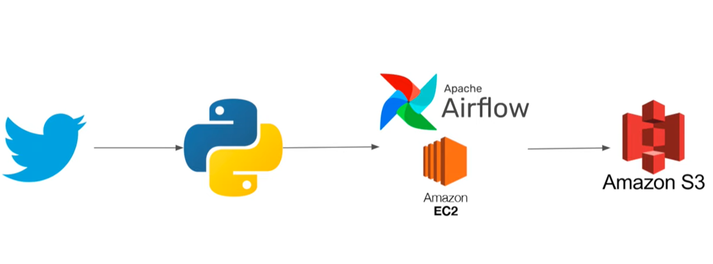

# Twitter-Data-Pipeline-using-Airflow-with-EC2-and-s3

## Project architecture: 

## Description : 
1-Extract data from Twitter and transform it  using Python code deployed on Apache Airflow.
2- Save the data in Amazon S3.

